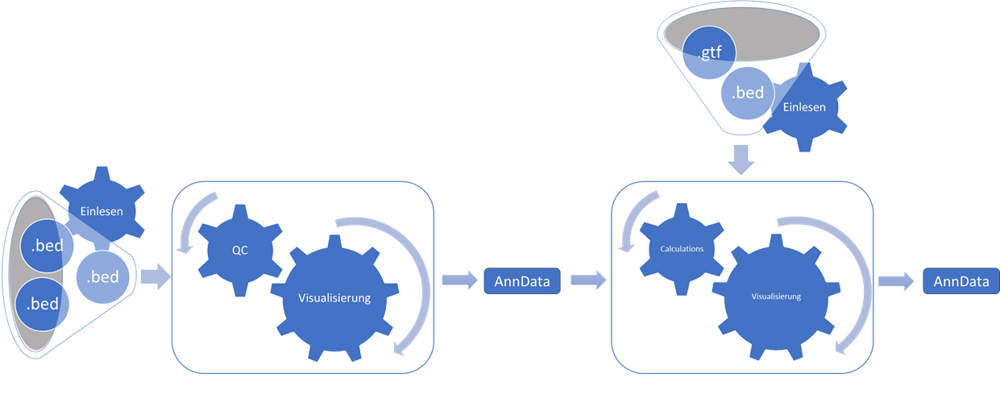

# Datenanalyse_2022_23

This repository contains all the tools and methods developed specifically for the course 
“Applied data analysis in bioinformatics” from the masters program “Bioinformatik und Systembiologie” 
at the Justus-Liebig-University and the Technische Hochschule Mittelhessen in the wintern term 2022/2023.

The goal of this course is to develop a pipeline for the [Max Planck Institute for Heart and Lung Research](https://www.mpg.de/149809/heart-lung-research)
which takes data from [CATLAS](http://catlas.org/humanenhancer/#!/) and performs distinct analyses mainly based on the chromatin accessibility[1](#--1-zhang-k-hocker-j-d-miller-m-hou-x-chiou-j-poirion-o-b-qiu-y-li-y-e-gaulton-k-j-wang-a-preissl-s-amp-ren-b--2021---a-single-cell-atlas-of-chromatin-accessibility-in-the-human-genome-cell-184--24---httpsdoiorg101016jcell202110024).

Furthermore, this pipeline is organized into two separate packages (WP1/WP2) due to the group distribution of the course. A short description of each package is given below:

- WP1:
  - The first part of the pipeline contains functions for reading __.bed files__, plotting and computation of quality control parameters
  like e.g. mean/median of the fragment lengths or an interpretable score. Additionally, with the help of __.gtf files__ it is possible to calculate
  the fragment distribution around TSS. 
- WP2:
  - The second part of the pipeline contains functions for calculating the feature overlap for each cell barcode to a given feature and visualize the calculated data with different plots.

Each package also contains a rich __README__ explaining all features and their functionality and how to use them. The slides of the final presentation held on the 01.03.23 can be taken from __presentation.pdf__.
To increase the understanding we developed a graphical representation of our pipeline, which can be seen below.

  

More detailed pictures of the two individual parts are given in their representative subfolders.