# THIS README IS NOT FINISHED AND STILL IN DEVELOPEMENT!!!

### Introduction

This repository contains all the tools and methods developed specifically for the course 
“Applied data analysis in bioinformatics” from the masters program “Bioinformatik und Systembiologie” 
at the Justus-Liebig-University and the Technische Hochschule Mittelhessen in the wintern term 2022/2023.

The goal of this course is to develop a pipeline for the [Max Planck Institute for Heart and Lung Research](https://www.mpg.de/149809/heart-lung-research)
which takes data from [CATLAS](http://catlas.org/humanenhancer/#!/) and performs distinct analyses mainly based on the so-called chromatin accessibility<sup>[1](#--1-zhang-k-hocker-j-d-miller-m-hou-x-chiou-j-poirion-o-b-qiu-y-li-y-e-gaulton-k-j-wang-a-preissl-s-amp-ren-b--2021---a-single-cell-atlas-of-chromatin-accessibility-in-the-human-genome-cell-184--24---httpsdoiorg101016jcell202110024)</sup>.   
Furthermore, this pipeline is organized into two separate packages (WP1/WP2) due to the group distribution in the course. Hence, the main purpose of
these methods is to be used by the second group (WP2), but they can nevertheless be used as a stand-alone tool. A graphical representation of our pipeline is given in the [appendix](#appendix).

In the following we are going to thoroughly illustrate all necessary steps to perform an analysis using this repository.
For this reason we will guide the reader through a basic example reproducing each important step, where we also explain the underlying methods
and their functionality along the way. We also provided a compact [Quick Start](#quick-start) section at the end for anyone who wants to get started right away. The rest of the following content is structured as follows.

1. [The data source](#The-data-source)
2. [Reading a fragment file](#Reading-a-fragment-file)
3. [Plotting](#Plotting)
   1. [Mean and Median](#Mean-and-Median)
   2. [Distribution into groups](#Distribution-into-groups)
4. [Distribution per cell](#Distribution-per-cell)
   1. [Calculate the fit](#Calculate-the-fit)
   2. [Calculate a score](#Calculate-a-score)
5. [Splitting fragments](#Splitting-fragments)
6. [Outlook](#outlook)
7. [References](#References)
8. [Quick Start](#testing)
9. [Authors](#Authors)

### The data source

As already mentioned in the introduction, the main data source for our pipeline is [CATLAS](http://catlas.org/humanenhancer/#!/). 
This website contains files generated from [Single-Cell ATAC-seq](https://genomebiology.biomedcentral.com/articles/10.1186/s13059-020-02075-3) (scATAC-Seq) done on human tissue.
Here, we exclusively focused on the _fragment files_, which consist of row(s) and columns. Each row represents a single fragment, whereas the columns specify the fragment further.
An excerpt of the fragment file [stomach_SM-JF1O3_rep1_fragments.bed](http://yed.ucsd.edu:8787/fragment/) can be seen below.

<p align="center">
   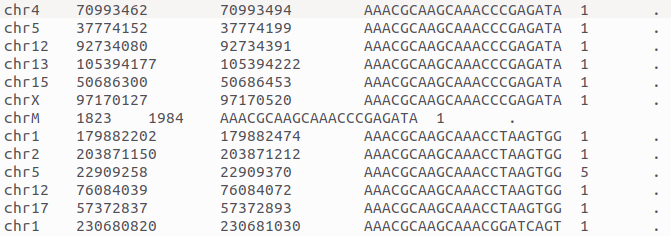
</p>

The structure represented above is the same over all provided fragment files. Furthermore, we can specify the
content of each column as follows<sup>[2](#--2-httpsenwikipediaorgwikibedfileformat)</sup>:

| Column Number | Name            | Description                                                                  |
|---------------|-----------------|------------------------------------------------------------------------------|
| 1             | Chromosome      | Abbreviated name of the Chromosome (e.g. chr1 stands for Chromosome 1, etc). |
| 2             | ChromosomeStart | Number of the start location of the fragment (in bp) on the chromosome.      |
| 3             | ChromosomeEnd   | Number of the end location of the fragment (in bp) on the chromosome.        |
| 4             | CellBarcode     | Unique identifier of the cell from which the fragment is extracted.          |
| 5             | Score           | Score of the fragment.                                                       |
| 6             | Strand          | DNA strand orientation ("+" = positive; "-" = negative; "." = no strand)     |

Moreover, in our approach we only use the columns ChromosomeStart, ChromosomeEnd and the CellBarcode
and completely omit the remaining ones. This is further explained in the subsequent chapter.

### Reading a fragment file

In the previous chapter we described the data files which function as input for our pipeline. Now, the first step is
to read these files. For this purpose we will use the method **read_fragment_file(abs_path: str)**. This method reads a fragment file (.bed) at the
absolute path location provided via parameter and returns a dictionary having the _cellbarcodes_ (column 1) as keys and the computed
_fragment lengths_ (column 2, column 3) as the corresponding values. Now, we can use this method with our file _stomach_frag_head_30.bed_, which simply contains
the first 30 lines of [stomach_SM-JF1O3_rep1_fragments.bed](http://yed.ucsd.edu:8787/fragment/).
    
    frag_dictionary = read_fragment_file("~/stomach_frag_head_30.bed")

Formatted printing of the _frag_dictionary_ yields the following output:

    AAACGCAAGCAAACCCGAGATA [32, 47, 311, 45, 153, 393, 161]
    AAACGCAAGCAAACCTAAGTGG [272, 62, 112, 33, 56]
    AAACGCAAGCAAACGGATCAGT [210, 56, 28, 42, 185, 75]
    AAACGCAAGCAAACGTCCCGTT [45, 33, 49, 227, 80, 94, 36, 340, 38]
    AAACGCAAGCAAACTAGCCCTA [48, 479, 85]

Reading a single file is a rather simple case. Thus, we also implemented a convenient wrapper method **read_fragment_directory(abs_path: str)** which
reads all fragment files (.bed) in a directory. Here, the absolute path of the directory is also provided via the parameter of the function. If this directory also
contains other files besides fragment files, they will be ignored by the function. Because the internal datastructure is a dictionary, we strictly prohibit the occurrence of
multiple cellbarcodes and simply extend the corresponding fragment list of the cellbarcode. Hence, enabling an easy-to-use approach for reading fragment files.

We went beyond the steps above and also implemented two additional convenience functions. The first being **combine_fragment_dictionaries(dictionary_list: list)** which takes a list of 
_fragment_dictionaries_ and merges them into one and the second one being **create_dataframe(frag_dictionary: dict, tissue="")**. This method uses a _fragment_dictionary_ and a string of a _tissue_
to create a dataframe<sup>[3](#font-size1---3-httpspandaspydataorgdocsreferenceapipandasdataframehtml-font)</sup>. The _tissue_ string here is used to append the cellbarcode resulting (literally) in the key of the
form below.

    tissue+cellbarcode

This enables a linking between cellbarcode and tissue the cellbarcode may be taken from and increases distinguishability. Important to mention here is that the resulting dataframe not only consists
of cellbarcodes and fragment length lists, but also of the computed _mean_ and _median_ of these lists. To demonstrate this method we can use the earlier 
created _frag_dictionary_ and pass it to our method.

    df = create_dataframe(frag_dictionary)

When printing the dataframe _df_ this results in the following output.

                              Mean Median                               Fragments
    AAACGCAAGCAAACGGATCAGT   99.33   65.5              [210, 56, 28, 42, 185, 75]
    AAACGCAAGCAAACGTCCCGTT  104.67     49  [45, 33, 49, 227, 80, 94, 36, 340, 38]
    AAACGCAAGCAAACCTAAGTGG   107.0     62                  [272, 62, 112, 33, 56]
    AAACGCAAGCAAACCCGAGATA  163.14    153        [32, 47, 311, 45, 153, 393, 161]
    AAACGCAAGCAAACTAGCCCTA   204.0     85                           [48, 479, 85]

These resulting dataframes are used in the next step of our pipeline, where they are processed and analyzed further. 

### Plotting
The package also provides multiple fuctions to visualise the extracted data. By importing the script plot.py the user can utilise functions to plot the distribution of different variables, compare them and furthermore filter by them.  These functions provide an simple way to visualise in connection with the created dataframe. The plotting itself is performed by seaborn. In the following the script was simply loaded as 'plot'.

    import src.plot as plot
    
#### Variable Distribution
Two functions are dedicated to visualise the distribution of an specific variable:

    histplt(df, column_name, output=None)
    vioplt(df, column_name, output=None)
Both get a dataframe, a column with one value per index and optional an output path to save the plot as variables and output the distribution of the specified column values.

    plot.histplt(df, 'Mean', output = '/home/user/')
<p align="center">
   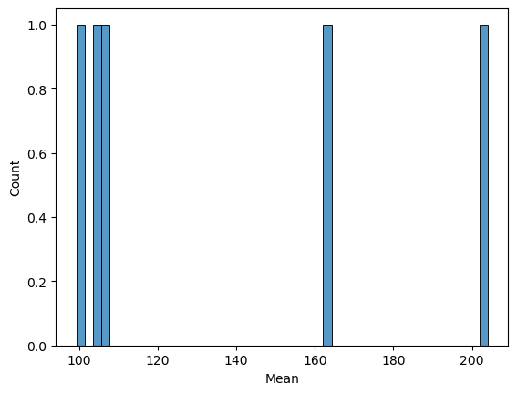
</p>

    plot.vioplt(df, 'Mean', output = '/home/user/')
<p align="center">
   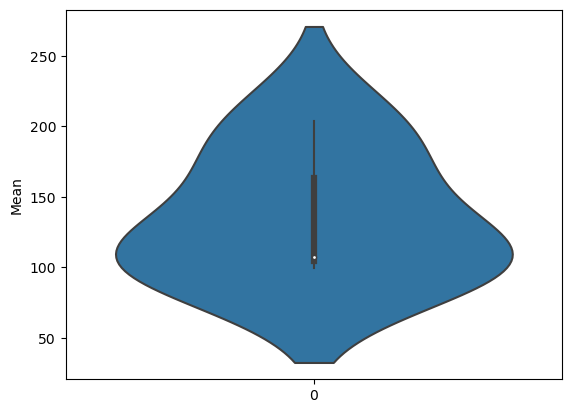
</p>

#### Variable Comparison
To compare two different variables to each other the following function can be used:

    compplt(df, column_name_1, column_name_2, output=None)
In contrast to the previous two functions, it gets two columns and visulises the data in form of a scatterplot with column 1 as x values and column 2 as y values.

    plot.compplt(df, 'Mean', 'Median', output = '/home/user/')
<p align="center">
   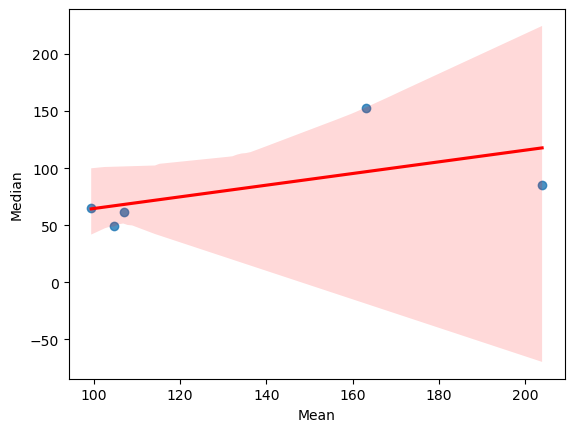
</p>

#### Distibution by Variable
There are also functions to visualize distributions binned by a specific variable. On the one hand you can bin cells by a variable and plot the distribution of there combined fragment length:

    bindistplt(df, data='Fragments', column_name='Mean', bins=1, mode='equal',
			     plot_bins=50, show=True, output_path=None)
Like the previous functions the main arguments are the dataframe and the name of the column to be visualized. By only specifing them, one plot will be generated with all fragments in it and the range of the variable in the title.

    plot.bindistplt(df, column_name='Mean')
<p align="center">
   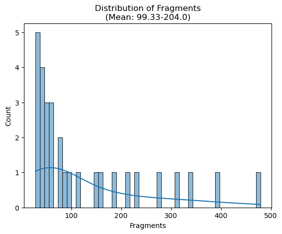
</p>
The argument "bins" determins the number of bins the data is devided in. For example a bins value of 2 will generate two plots with a different range of the specified variable.

    plot.bindistplt(df, column_name='Mean', bins = 2)
<p align="center">
   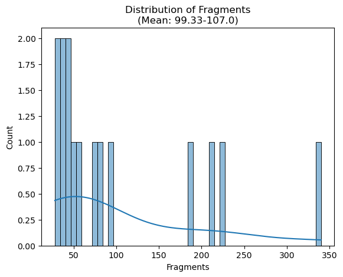
</p>
<p align="center">
   
</p>
"Mode" changes how the size of the bins is calculated. "equal" means the same number of cells and "linear" means the same range of the variable in one bin.

    plot.bindistplt(df, column_name='Mean', bins = 2, mode = 'linear')
<p align="center">
   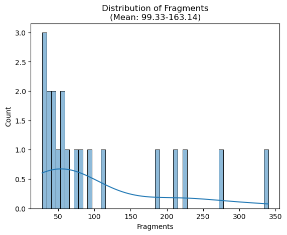
</p>
<p align="center">
   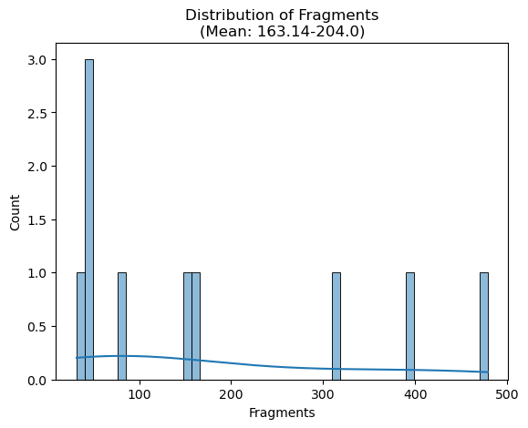
</p>
To use the function with different, but simular formatet data, the argument 'data' can be specified. Furthermore the argument "plot_bins" can be used to define the plot resolution and "show" and  "output_path" control the kind of output that is generated.

#### scDistribution by Variable
On the other hand you can plot the fragment distribution of each cell grouped and filterd by a variable:

    multiplt(df, column_name='Fragment-Count', distribution='Distribution', bins=1,
			    mode='base', lower_limit=None, upper_limit=None, output_path=None)
Like every function in this package, the arguments for the dataframe and the name of a column are essentiell for this function. 

    plot.multiplt(df, column_name='Mean')
<p align="center">
   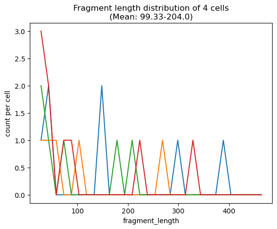
</p>
The use of "bins", "output_path" and "distribution" (previously "data") is equal to the previous function, but the method of bin size calculation is exclusively "linear" (same variable range in each bin). "mode" determins the scaling of the distribution data. If not defined, the y axis displays the fragment count per cell, "normalize" normalizes the y values with the formula normalized y = y-min(y)/(max(y)-min(y) and "percent" displayes the frequency within each cell.

    plot.multiplt(df, column_name='Mean', mode = 'normalized')
<p align="center">
   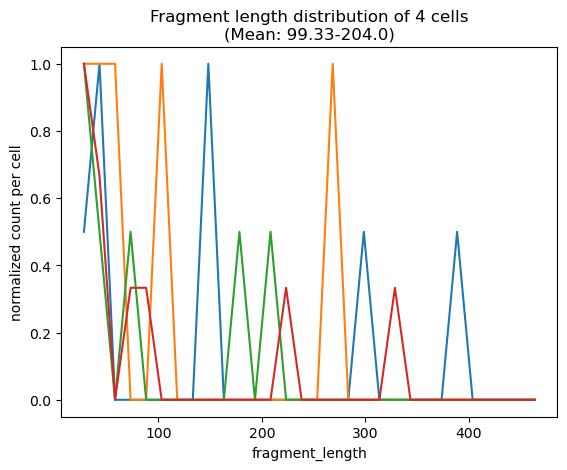
</p>

    plot.multiplt(df, column_name='Mean', mode = 'percent')
<p align="center">
   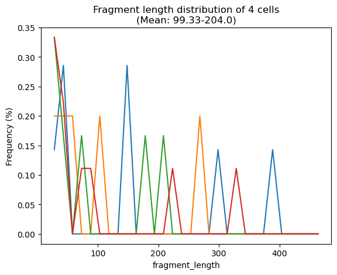
</p>
Furthermore the range that gets binned can be specified by the arguments "upper_limit" and "lower_limit". 

    plot.multiplt(df, column_name='Mean', bin = 2, mode = 'percent',
				    upper_limit = 200, lower_limit = 300)
<p align="center">
   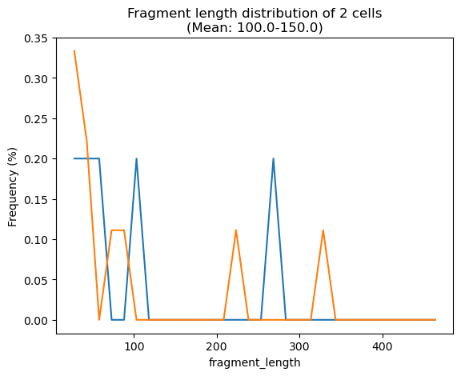
</p>
<p align="center">
   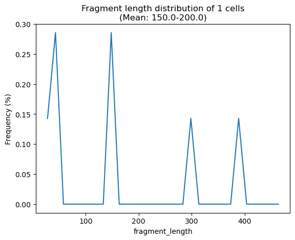
</p>


#### Calculate a score

Having lists of fragment lengths linked to individual cells is great, but it would also be nice to have a numerical value which
enables an interpretation regarding the quality of the data. Following this specification we developed such a scoring function that follows two
steps.

    1. Peak-Calling
    2. Average Difference of the Peak Location

To fulfill the first step we use the method **calculate_maxima(value_list)**, which takes a list of numerical values and returns the indices of all
**local maxima** (peaks) found in the list. The peak-calling itself is realized by a __sliding window__ approach. Here, we have a window of size 5 which is 
pushed through the provided list and adds a peak index to the list of peaks if and only if the value in the middle of the window is larger than all its neighbours.
Thus, resulting in a linear algorithmic runtime of O(n)<sup>[4](#font-size1---4-httpwwwinffu-berlindelehress12alp2slidesv6rekursionvsiterationalp2pdf)</sup>, where n is the length of the list.
An exemplary run of the algorithm with the values of the window visualized in each step can be seen below.

    INPUT: [0,3,4,2,3]
    PEAKS = []
                      ↓
    i=0: [None, None, 0, 3, 4]
                   ↓
    i=1: [None, 0, 3, 4, 2]
                ↓
    i=2: [0, 3, 4, 2, 3] -> 4 is larger than all its neighbours in the window; PEAKS = [2]
                ↓
    i=3: [3, 4, 2, 3, None]
                ↓
    i=4: [4, 2, 3, None, None]

    PEAKS = [2]

Furthermore, to get a score based on real and not abstracted data we use the distribution of fragment lengths in each cell.
This data is saved in the column "Distribution" of our dataframe. Let's say we are only interested in a score for the first cell
of the dataframe for now, then we can perform the peak calling as follows:

    peak_indices = calculate_maxima(df["Distribution"][0])

When comparing the __peak_indices__ list and the distribution, we can observe the calculated peaks below. 

    peak_indices: 
    [1, 8, 18, 24]

    df["Distribution][0]:
    [1, 2, 0, 0, 0, 0, 0, 0, 2, 0, 0, 0, 0, 0, 0, 0, 0, 0, 1, 0, 0, 0, 0, 0, 1, 0, 0, 0, 0, 0]
        ↑                    ↑                             ↑                 ↑

Now, for the second step we implemented the
method **calculate_score(peaks, min_frag, bin_size, bins=30, period=160)**. This function expects a list of 
peak indices, a value for the smallest fragment length and a value for the bin size and computes the average difference of the peak distance and a period value.
Additionally, the method differentiates 3 cases:

1. The peak list is empty
   - Return (positive) infinity
2. The peak list contains only one peak
   - Compute the difference between the peak location and the period plus the minimal fragment length
3. The peak list contains more than one peak
   - Compute the average peak and period difference
   
This creates an assessable score with 0 being the best and positive infinity the worst possible value. 
An abstract representation of how the algorithm works based on the previous __peak_indices__ list and a bin size of
15 is given below. 

    peak_indices: 
    [1, 8, 18, 24]

    1*bin_size            8*bin_size            18*bin_size            24*bin_size
          ╚═══════════════════╝ ╚════════════════════╝ ╚════════════════════╝   
             ||(15-8*15)|-160|   ||(8*15-18*15)|-160|   ||(18*15-24*15)|-160|
                  =                       =                      =
                  55                      10                     70
         
    -> Summarize all terms and divide by number of terms
    -> (55+10+70) / 3 = 45

When we use our method with the same bin size we also get the same result.
```
score = calculate_score(peak_indices, 0, 15)
print(score)
```
```
45.0
```
    
### Splitting fragments

### Outlook

### Quick Start

HIER WENIG ERKLÄRUNG UND GLEICH MIT CODE LOSLEGEN

AUCH AUF TESTDATENSATZ EINGEHEN

### References

#### <font size=1>- [1] Zhang, K., Hocker, J. D., Miller, M., Hou, X., Chiou, J., Poirion, O. B., Qiu, Y., Li, Y. E., Gaulton, K. J., Wang, A., Preissl, S., &amp; Ren, B. (2021). A single-cell atlas of chromatin accessibility in the human genome. Cell, 184(24). https://doi.org/10.1016/j.cell.2021.10.024 </font>
#### <font size=1>- [2] https://en.wikipedia.org/wiki/BED_(file_format) </font>
#### <font size=1>- [3] https://pandas.pydata.org/docs/reference/api/pandas.DataFrame.html </font> 
#### <font size=1>- [4] http://www.inf.fu-berlin.de/lehre/SS12/ALP2/slides/V6_Rekursion_vs_Iteration_ALP2.pdf


### Authors

    Leon Marvin Geis
      leon.marvin.geis@bioinfsys.uni-giessen.de
      
    Jannik Luebke 
      jannik.luebke@bioinfsys.uni-giessen.de

    Aviral Jain
      aviral.jain@bioinfsys.uni-giessen.de 

---