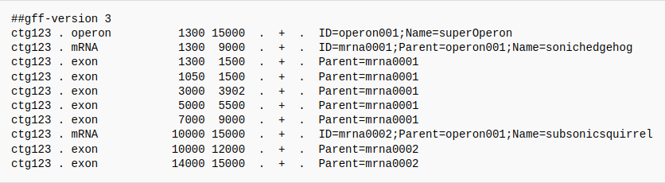
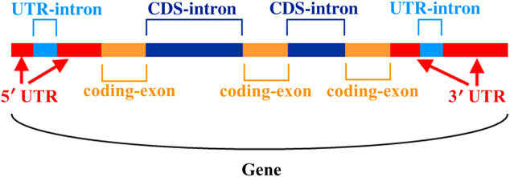
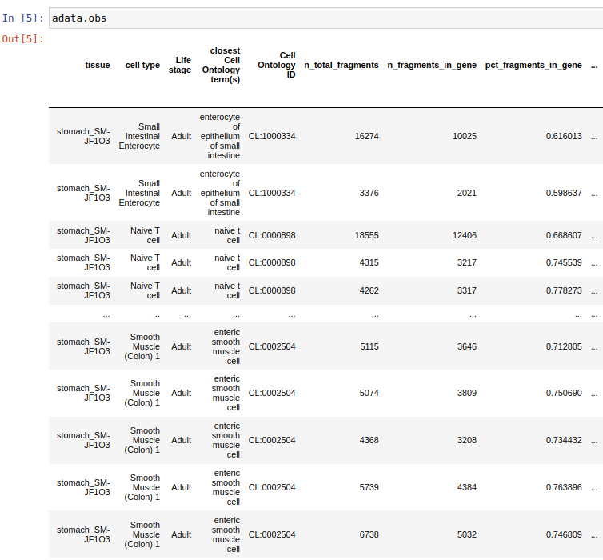

### Introduction

This WP worked on tools that generates and adds new data to the generated
[Anndata](https://anndata.readthedocs.io/en/latest/)<sup>[2](#font-size1---2-httpsscanpyreadthedocsioenstable-font)</sup>
Object from [WP1](../wp1/README.md).
The data generated by WP2 focuses mainly
on the Overlap  of reads from a single cell to a given feature mapped on a reference genome. Such a feature
can be for example the promoter-region or the enhancer-region of a gene.
The data can then be
visualized and checked for correlations between the generated Feature data via Violin, UMAP and Scatter Plots.
Furthermore, the data created by WP1 can also be visualized with these tools.


In the following we will talk about how to acquire the data we need and how to find or produce the informations we want.
In the Chapter [Quick Start](#quick-start) you'll find an Introduction on how to use the methods.


1. [The data source](#The-data-source)
   1. [Pipeline](#Pipeline)
2. [Reading a General Feature File](#Reading-a-General-Feature-File)
   1. [Annotated Features](#Annotated-Features)
   2. [Other Features](#Other-Features)
   3. [Wrapper Function](#Wrapper-Function)
3. [Calculating Feature Overlap](#Calculating-Feature-Overlap)
4. [Data Presentation](#Data-Presentation)
   1. [Different Presentation Styles](#Different-Presentation-Styles)
6. [Functions](#Functions)
   1. [Dimension Reduction](#Dimension-Reduction)
   2. [Feature Comparison in Violinplots](#Feature-Comparison-in-Violinplots)
7. [References](#References)
8. [Quick Start](#quick-start)
9. [Authors](#Authors)

### The data source

For the purpose of this course, we used the Human reference genome hg38 accessible from [NCBI](https://www.ncbi.nlm.nih.gov/assembly/GCF_000001405.26/)<sup>[3](#font-size1---3-httpswwwncbinlmnihgovassemblygcf00000140526-font)</sup>.
This reference Genomes comes in the [General-Feature-File](https://www.ensembl.org/info/website/upload/gff.html)(GFF)<sup>[4](#font-size1---4-httpswwwensemblorginfowebsiteuploadgffhtml-font)</sup>
Format, which is a standardized way of storing informations about regions in a Genome inside a text
file. This text file consists of a possible Header entry and a line for every region in the genome, with each line having
9 columns of data entrys.
Below you can find an example for a [GFF](https://www.ensembl.org/info/website/upload/gff.html) file from the
[GMOD](http://gmod.org/wiki/GFF3)<sup>[5](#font-size1---5-httpgmodorgwikigff3-font)</sup> Wiki.
<p align="center">
   
</p>

The next table provides information about each column a line can have, empty columns are denoted with a '.' <sup>[3](#font-size1---3-httpswwwensemblorginfowebsiteuploadgffhtml-font)</sup>.

| Column Number 	| Name      	| Description                                                                                                                                                         	|
|---------------	|-----------	|---------------------------------------------------------------------------------------------------------------------------------------------------------------------	|
| 1             	| seqname   	| Name of the chromosome or scaffold                                                                                                                                  	|
| 2             	| source    	| Programm that generated the feature, or the source of the data                                                                                                      	|
| 3             	| feature   	| Feature type                                                                                                                                                        	|
| 4             	| start     	| Start position of the feature on the reference genome                                                                                                               	|
| 5             	| end       	| End position of the feature on the reference genome                                                                                                                 	|
| 6             	| score     	| Floating point value                                                                                                                                                	|
| 7             	| strand    	| + (forward) or - (reverse)                                                                                                                                          	|
| 8             	| frame     	| One of '0', '1' or '2'. '0' indicates that the first base of the feature<br>is the first base of a codon, '1' that the second base is the first base <br>of a codon 	|
| 9             	| attribute 	| List of semicolon-seperated additional features                                                                                                                     	|

Also this WP uses the same fragment files provided by [CATLAS](http://catlas.org/humanenhancer/#!/) as used by WP1.
A brief description of the `.bed` file Format the fragment file comes in can be found in their respective [README.md](../wp1/README.md)
`The data source` Chapter. </br>
At last we need a `.h5ad` File, that
contains an prepared [Anndata](https://anndata.readthedocs.io/en/latest/) object, here generated from [WP1](../wp1/README.md).

#### Pipeline

To calculate a feature overlap, we first need to know where the specific features are
located on the reference genome. These features are annotated in the third column of the [GFF](https://www.ensembl.org/info/website/upload/gff.html) file.
This column holds information about the feature type of the specific line, with a predefined vocabulary <sup>[6](#font-size1---6-httpswwwinsdcorgsubmitting-standardsfeature-table-font)</sup>.
The fourth and fifth Column in this line describes the Start and Stop Position of this feature on the reference
genome. For later calculations it is mandatory to generate separate [GFF](https://www.ensembl.org/info/website/upload/gff.html) files,
where each file containing only lines with the same feature. We talk on how to use the provided tools for
generating these files in the next Chapter.</br>
The location of a read inside a [fragment](../WP1/README.md) file, can be found in the second and third column of a line.
By counting the number of reads from the fragment file that's position is inside the location of a feature
from the reference genome we can finally calculate the feature overlap rate and store it to the
[Anndata](https://anndata.readthedocs.io/en/latest/) object.


### Reading a General Feature File

To generate the feature filtered [GFF](https://www.ensembl.org/info/website/upload/gff.html) file, the package
_gff\_analyser_ provides the two modules:

- gffBuilder.py
- gffClasses.py

The _gffBuilder.py_ contains a parser for the [GFF](https://www.ensembl.org/info/website/upload/gff.html) file format,
which stores the file information into an object and a wrapper function to generate all possible feature files. The parser is used as follows:

```py  
object_list = build_gff3_class(file: list)
```

The input needed for this function:

- file = A list containing the Paths of the input files. Multiple Files can be processed at te same time

Inside the list _object\_list_ one object for each input file is stored. By iterating with a `for`-loop
over this list we can now use the methods of these objects. It would be possible here to replace the
variable `features` with a a list containing only 1 string of the desired feature to investigate, so that only a file of this specific
feature is generated.</br>

The wrapper function for generating all feature files is called by:

```py  
generate_feature_files(adata: anndata, gtf_file: list, fragments: str, enhancer_bed: str, blacklisted_bed: str, promoter_distance: int, tss_distance: int, out: str)
```

The input needed for this wrapper function is:

- adata = The object for the tissue to analyse
- gtf_file = The reference genome [GFF](https://www.ensembl.org/info/website/upload/gff.html) File
- fragments = A Path to the fragment file
- enhancer_bed = Path to the downloaded _enhancer.bed_ from [NCBI](https://www.encodeproject.org/references/ENCSR938RZZ/)
- blacklisted_bed = Path to the downloaded _blacklisted\_region.bed_ [NCBI](https://www.encodeproject.org/references/ENCSR938RZZ/)
- promoter_distancer = Interger representing a stated promoter distance
- tss_distance = Integer representing the TSS distance
- out = Output Directory

The _gffClasses.py_ contains all the methods needed for generating the [GFF](https://www.ensembl.org/info/website/upload/gff.html)
files. A more detailed use of these methods can be found in following Chapters.

#### Annotated Features

To generate a file for each feature annotated inside
these objects, we can use the method `self.generate_feature_gtf(feature_keys: list, out: str)`
</br>The input the method uses are:

- feature_keys = A list of features to analyse
- out = Output Directory

 

Below an example for generating all possible feature files is shown:

```py  
for element in organism_list:
    features = element.count_features()        
    element.generate_feature_gtf(feature_keys=features)
```
        
The method `features = element.count_features()` returns a list of all existing features inside the
[GFF](https://www.ensembl.org/info/website/upload/gff.html) file, so the method `element.generate_feature_gtf(feature_keys=features)`
knows what files exactly to generate, as this list is used as positional argument in this method.
The generated files will now be placed inside an _out/_ folder, created inside the current working directory.

#### Other Features

Some features like promoters are not directly annotated inside a [GFF](https://www.ensembl.org/info/website/upload/gff.html) file,
but can be calculated by the gene model as shown exemplarily in the image<sup>[7](#font-size1---7-httpswwwresearchgatenetfigurean-illustration-of-a-typical-structure-of-a-eukaryotic-gene-a-gene-may-have-manyfig351510353-font)</sup> below:

<p align="center">
   
</p>

The features this WP focused on are as listed:

- [Promoter](#Promoter)
- [Transcription Start Site (TSS)](#TSS)
- [Gene Body](#Gene-Body)
- [Peaks](#Peaks)
- [Blacklisted Regions](#Blacklisted-Regions)
- [Enhancer](#Enhancer)

The information for the enhancers and blacklisted regions are accessed through
the database [NCBI](https://www.encodeproject.org/references/ENCSR938RZZ/)<sup>[8](#font-size1---8-httpswwwencodeprojectorgreferencesencsr938rzz-font)</sup>, where
a `.bed` file with the sequence regions is provided.</br>
With the information gathered in the [previous Chapter](#Annotated-Features)
and the database, we can now calculate the positions of these new features.
The methods provided in _gffClasses.py_ either re-evaluate the start and end Positions of
the corresponding objects inside the _object\_list_ or make use of _Bedtools_<sup>[9](#font-size1---9-httpsbedtoolsreadthedocsioenlatest-font)</sup> 
and write them to a file inside the output directory.

##### Promoter

To get a promoters start and stop Position, we first need to know where a gene is located. From the genes start 
position we can subtract a stated length which represents the corresponding promotors start position. The end position
of this promotor is the start of the corresponding gene.</br>
To generate a [GFF](https://www.ensembl.org/info/website/upload/gff.html) file containing only promoter regions 
we can call the method: 

```py              
self.generate_promoter_gtf(promoter_distance: int, out: str)
```


The input needed for this method is:

- promoter_distance = Stated length of promoter, for example `2000`
- out = Output Directory

##### TSS

To get the TSS start and stop Position, we also need to know where a gene is located. From the gene start, we
can add a stated length to the start to get the end position of the TSS.</br> The method for generating a TSS feature file is:

```py  
self.generate_tss_gtf(tss_distance: int, out: str)
```

The input needed for this method is:

- TSS_distance = Stated length of the TSS, for example `100`
- out = Output Directory

##### Gene Body

The gene bodies can be found by subtracting the Five and Three prime UTR from the gene feature annotated
lines in the [GFF](https://www.ensembl.org/info/website/upload/gff.html) file by using bedtools subtract. To create this file, a Version of
a [GFF](https://www.ensembl.org/info/website/upload/gff.html) file containing only genes must be previously generated 
and placed inside the output directory for this method to work.</br>
The method for generating a Gene Body feature file is:

```py  
self.generate_gene_body_gtf(out: str)
```

The input needed for this method is:

- out = Output Directory

##### Peaks

The peak data were generated by the [CATLAS](http://catlas.org/humanenhancer/#!/)-project with 
[MACS2](https://genomebiology.biomedcentral.com/articles/10.1186/gb-2008-9-9-r137)<sup>[10](#font-size1---10-httpsgenomebiologybiomedcentralcomarticles101186gb-2008-9-9-r137-font)</sup>
and the parameters: `--shift -75 --extsize 150 --nomodel --call-summits --SPMR -q 0.01`. This data is accessible in
the [Anndata](https://anndata.readthedocs.io/en/latest/).var table. </br>Intersecting these Data with the reference
genome [GFF](https://www.ensembl.org/info/website/upload/gff.html) file, yields a file with only the information
about peaks for the given tissues.
</br> The wrapper method for this is:

```py  
self.generate_peak_gtf(adata: anndata , gtf_file: str, out: str)
```

The input needed for this wrapper method is:

- adata = The object for the tissue to analyse
- gtf_file = Path of the reference genome [GFF](https://www.ensembl.org/info/website/upload/gff.html) File
- out = Output Directory


** When using this function we need to enumerate the [_object\_list_](#Reading-a-General-Feature_File)
and use the counter to index the [GFF](https://www.ensembl.org/info/website/upload/gff.html) file input. Otherwise Multifile support won't work, because input-files are given
inside a list.</br>
An example is shown here:</br>
```py  
object_list = build_gff3_class(file=gtf_file)

for i, element in enumerate(object_list):
    features = element.count_features()
    element.generate_peak_gtf(adata=adata, gtf_file=gtf_file[i], out=out)
```


##### Blacklisted Regions

With the `.bed` files acquired from [NCBI](https://www.encodeproject.org/references/ENCSR938RZZ/) 
we can intersect the fragment file and the _blacklisted\_region.bed_ with bedtools.
</br>The wrapper method for this is:

```py  
self.generate_blacklisted_region_gtf(gtf_file: str, blacklisted_bed: str, out: str)
```

The input needed for this wrapper method is:

- gtf_file = Path of the reference genome [GFF](https://www.ensembl.org/info/website/upload/gff.html) File 
- blacklisted_bed = Path to the downloaded _blacklisted\_region.bed_ [NCBI](https://www.encodeproject.org/references/ENCSR938RZZ/)
- out = Output Directory

** When using this function we need to enumerate the [_object\_list_](#Reading-a-General-Feature_File)
and use the counter to index the [GFF](https://www.ensembl.org/info/website/upload/gff.html) file input. Otherwise Multifile support won't work, because input-files are given
inside a list.

##### Enhancer

With the `.bed` files acquired from [NCBI](https://www.encodeproject.org/references/ENCSR938RZZ/) 
we can intersect the fragment file and the _enhancer.bed_ with bedtools.
</br>The wrapper method for this is:

```py  
self.generate_enhancer_gtf(gtf_file: str, enhancer_bed: str, out: str)
```

The input needed for this wrapper method is:

- gtf_file = Path of the reference genome [GFF](https://www.ensembl.org/info/website/upload/gff.html) File 
- enhancer_bed = Path to the downloaded _enhancer.bed_ from [NCBI](https://www.encodeproject.org/references/ENCSR938RZZ/) 
- out = Output Directory

** When using this function we need to enumerate the [_object\_list_](#Reading-a-General-Feature_File)
and use the counter to index the [GFF](https://www.ensembl.org/info/website/upload/gff.html) file input. Otherwise Multifile support won't work, because input-files are given
inside a list.


### Calculating Feature Overlap

For the calculation of the feature overlap, a function developed by an organisation from Prof. Dr. Mario Looso 
from the [Max Planck Institute for Heart and Lung Research](https://www.mpg.de/149809/heart-lung-research).
 This function calculates the total number of reads per cell barcode and the number of reads
coming from a given feature, from which we can get the feature overlap rate by dividing the number of reads per feature 
through the total number of reads for every cell barcode.
</br>This is the wrapper function for calculating feature overlaps for all feature files in a given input directory.

```py  
pct_fragments_in_features(adata: anndata, input_dir: str, fragments_file: str)
```

The input needed for this wrapper function is:

- adata = Anndata Object the results are stores to
- input_dir = Directory containing the feature files
- fragments_file = Path to a sorted _fragment file_ \[sort -k1,1 -k2,2n {out_unsorted} > {out_sorted}\]

It is also possible to calculate the feature overlap for only one given feature with this function.

```py  
pct_fragments_in_feature(adata: anndata, feature: str, fragments_file: str)
```


The input needed for this function is:

- adata = Anndata Object the results are stores to
- feature = A Feature the [GFF](https://www.ensembl.org/info/website/upload/gff.html) File should be searched for
- fragments_file = Path to a sorted _fragment file_ \[sort -k1,1 -k2,2n {out_unsorted} > {out_sorted}\]

The total number of reads, the reads per feature and the feature overlap for this feature are then
added to the [Anndata](https://anndata.readthedocs.io/en/latest/).obs field. Below you
find an example for the feature overlap for annotated genes:

<p align="center">
   
</p>


### Data Presentation

After preparing the data for presentation with some normalization and filtering, such as, but not limited to, removing chromosomes X, Y (Optional) and M, removing cells without features or empty features.
These functions are combined into the `presentation.py` script, to avoid unnecessary clutter in any `Jupyter Notebook` you might use them in.

#### Different Presentation Styles

The violin plots are helpful to quickly assess if there are plenty of cells in a dataset, furthermore it displays the mean and their dispersion. This can be used to compare the overall spread of featurerate per cell. One function that we implemented `compare_feature_to_celltypes` compares, as the name suggests, one feature against all celltypes, this will result with a plot like this [TODO]. If you found celltypes that have virtue, you can compare them in greater detail by firstly calling `compare_feature_to_celltype` taking nearly the same parameters but limiting the output violins to the base values of all cells and the specific celltype.
To reduce unnecessary clutter the celltypes are grouped and binned, this happens in `get_groups_with_size`.
The final function to display data is the `Dimensionreduction`, as the name implies it tries to reduce the dimension of the presented data. The algorithm we are using is called `umap` combined with `leiden` 

<!-- 
TODO:
    - compare_feature_to_celltypes
      - plot
      - parameter description
    - compare_feature_to_celltype
      - plot
      - parameter description
      - description how groups are made
    - Dimensionreductio
      - factcheck
    - Groups
      - 
 -->


### Functions

#### Dimension Reduction
```py
def compare_dimesionreductions(adata, key: str or list, comparator: str or list)
```
<!-- update function signature -->

Parameter|Type|Description
---:|---|:---
adata | AnnData | The AnnData that is to be examined
key | String or List of Strings | The key or keys (features) that are displayed
comparator | String or List of Strings | The key or keys (Cell Type) that are used to compare the keys to
out | String (optional) | The location that the figures are saved to

#### Feature Comparison in Violinplots

```py
def compare_feature_to_celltypes(adata, feature: list or str, comparator: str, max_size, out=None, sharey=True):
def render_feature_to_celltype(adata, feature, celltype, name, out=None, sharey=True):
```


Parameter|Type|Description
:---:|:---:|:---
adata | AnnData | The AnnData that is to be examined
key | String or List of Strings | The key or keys (features) that are displayed
comparator | String or List of Strings | The key or keys (Cell Type) that are used to compare the keys to
save | String (optional) | The location that the figures are saved to
groups | List of Strings (optional) | a list of values out of `comparator` that are worth extra attention


#### Utility Functions

```py
def get_sorted_groups_with_size(adata, feature: str, max_size: int, key: str = 'cell type', groups=None):
```

Parameter|Type|Description
:---:|:---:|:---
adata | AnnData | The AnnData object that is to be examined
feature | String | The feature to sort after
max_size | Integer | The maximal size that a group should have
key | String | The column in the AnnData that should be used as a grouping, defaults to 'cell type'.
groups | List of String (optional) | A limited list out of key that is used for grouping instead.

### Quick Start

To ease you into understanding the concepts and ideas behind our solution, we invite you to take a quick tour through our workpackage in this notebook.

Starting off, you should pay attention to `requirement.txt` to make sure, that all the dependencies are installed in the correct version. This can be achieved by creating an environment with `conda` or `virtual environment` and runnin `pip install -e .`, however, this will not install SCToolBox, which is required to run parts of our project.

You will also have to take extra care to fill out the environmental variables to make sure you aren't running into permission issues or `file not found` errors. We tried to make the generation and labeling of these intuitive.

After reading the h5ad object, we adjust the peak names, as those are coming in a format that isn't working with the tools we got. Specifically we turn the peak name of a format like `chr1:{START}-{STOP}` into `chr1_{START}_{STOP}`. We also change the observation names from `{TISSUENAME}+{BARCODE}` into only the barcodes.

To generate the required GTF files you can run the function `generate_feature_files` in `GffBuilder`, which is explained in more detail in the section [General Feature File](#reading-a-general-feature-file).


### References


#### <font size=1>- [1] Zhang, K., Hocker, J. D., Miller, M., Hou, X., Chiou, J., Poirion, O. B., Qiu, Y., Li, Y. E., Gaulton, K. J., Wang, A., Preissl, S., &amp; Ren, B. (2021). A single-cell atlas of chromatin accessibility in the human genome. Cell, 184(24). https://doi.org/10.1016/j.cell.2021.10.024 </font>
#### <font size=1>- [2] https://scanpy.readthedocs.io/en/stable/ </font>
#### <font size=1>- [3] https://www.ncbi.nlm.nih.gov/assembly/GCF_000001405.26/ </font>
#### <font size=1>- [4] https://www.ensembl.org/info/website/upload/gff.html </font>
#### <font size=1>- [5] http://gmod.org/wiki/GFF3 </font>
#### <font size=1>- [6] https://www.insdc.org/submitting-standards/feature-table/ </font>
#### <font size=1>- [7] https://www.researchgate.net/figure/An-illustration-of-a-typical-structure-of-a-eukaryotic-gene-A-gene-may-have-many_fig3_51510353 </font>
#### <font size=1>- [8] https://www.encodeproject.org/references/ENCSR938RZZ/ </font>
#### <font size=1>- [9] https://bedtools.readthedocs.io/en/latest/ </font>
#### <font size=1>- [10] https://genomebiology.biomedcentral.com/articles/10.1186/gb-2008-9-9-r137  </font>


### Authors

    Daniel Tischler
        daniel.tischler@bioinfsys.uni-giessen.de

    Noah Leon Stürtz
         noah.leon.stuertz@bioinfsys.uni-giessen.de